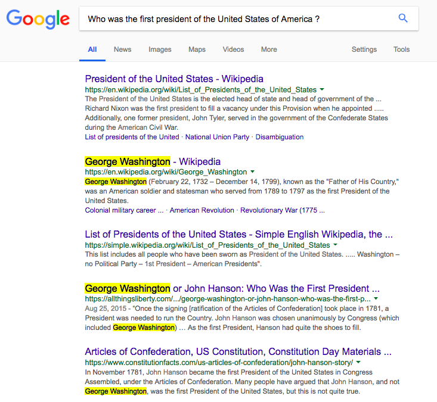

# Multiple Choice Questions Robot

This is my implementation of a simple bot to answer multiple choice questions (MCQs).
MCQs are questions where the answer is one of the given choices with the question.
For example:

```
Who was the first president of the United States of America ?
1.) Abraham Lincoln
2.) Benjamin Franklin
3.) George Washington
```

MCQs are considered as quite easy in the domain of artificial intelligence as the number of possibilities is finite and most of the time really restricted. Most techniques to answer open field questions however, require semantic analysis in order to understand some text and extract the right information at the right place.
We here thus focus on an easier, yet funny, famous NLP problem. We will also discuss at the end the possibilities to use this MCQ bot to reply to "pseudo open field" questions.

## Goal

The idea is pretty simple, design a function that takes as input a question, and a list of choices (number of choices is not fixed), and that returns the index of the choice you believe is the right one.


## Design

I came up with a pretty simple idea, by asking myself, how do I normally reply to questions I don't know. Do I reach my shelf to grab a dictionary or do I ask Google ? Easy question.

Indeed, when you ask yourself a question, it is quite likely that Google knows it. My bot thus uses Google to find the answer, in a really simple manner.

For each choice, it gives it a score. The method I designed is occurence-based, meaning that the score of each choice is based on its occurences on the google search. The google search is also pretty simple, it is the text you would read when you would type the question in google. There is a simple API that lets you make some research in google, which has been wrapped in python, [Google-Search-API](https://github.com/abenassi/Google-Search-API). Making a google search is as easy as:

```py
from google import google
my_search = google.search('winner world cup 2018')
```


After cleaning the text extracted from the search, I concat all the text together as one really long string that represents all the text available on first pages of wikipedia. Now it's time for scoring.

I introduced here the two methods I tried.

### Method 1

First method is super simple method. I delete the first word of the choice if it's a **stopword**, stopwords are words usually filtered out before or after processing of natural language, such as `the`, `a`, `that` etc.
Then I simply count the number of times I find the choice in the long string, just like you would do it when you Ctrl F on a google search, as shown below:



The chosen score is thus the score with highest count

### Method 2

Second method is a bit smarter, it is using n-grams. As a reminder, if the sentence is 'My name is Bob', then,
```py
1-grams = ["My", "name", "is", "Bob"]
2-grams = ["My name", "name is", "is Bob"]
etc.
```

Rather that counting in the google search result the entire choice string (preprocessed), we look for the 1-grams, 2-grams and the full string (preprocessed as method 1).
The score is thus the sum of these sub scores, each sub score having a multiplier:

```
total_score = 1*(1-grams occurences) + 3*(2-grams occurences) + 10*(full string)
```

In that way, if only one word of the choice occurs, it only adds 1 point to the total score, if a 2-gram is found is found, adds 3 points, and if the full string is found, it adds 10 points.

For example, it is relevant to take in consideration the word **Washington** by itself as **George Washington** can he can be called M. Washington, or President Washington etc. But of course, if both words **George** and **Washington** are found side by side it should adds more points.

---

Method 2 gave me better results, as it is really good when the choice is composed of several words.

## Data

I created a simple dataset, that contains for now only french samples. The format is pretty simple, each line is:

```
question;choice1;choice2;...;choiceN;right_answer_index
```

That means for the above example we would have:
```
Who was the really first president of the United States ?;Abraham Lincoln;Benjamin Franklin;George Washington;3
```

Data can be found in the **data/** subdir, that contains only for know a little french dataset that I have been using.
**Feel free to use it, improve it, or create new ones and share them.**

## Installation

This project has been developped in python **2.7**, the good ol' verision.
Requirements can be found in the file requirements.txt, install them with pip:
```
pip install -r requirements.txt
```

Requirements are:
```
nltk==3.2.1
numpy==1.11.1
protobuf==3.6.0
Google-Search-API==1.1.13
```

## Results

I added a simple function call **test_accuracy**, that you can find in **strategy_tester.py** in order to test a MCQ bot strategy.
I used this function to evaluate my bot after each upgrades in order to measure improvements.
To evaluate my bot, or your own, you can just modify the file **run_me.py**:

```py
from strategy_tester import test_accuracy
from mcqbot import answer

def bot_test_accuracy():
    data_file= 'data/data_french.csv'
    accuracy, average_time = test_accuracy(data_file, answer)
    print '\nAVERAGE TIME: %.2fs'% average_time
    print '\nACCURACY: %2.f%%\n'% (100*accuracy)

if __name__ == '__main__':
    bot_test_accuracy()
```


**(2018/07/02)** My accuracy with current best strategy:

```
ACCURACY: 88%
AVERAGE TIME: 1.52s
```

Interestingly enough, as results depend on google searchs, and that the latter is
depending on a bunch of stuff including the cookies and everything, accuracy varies regarding the place you are (the wifi or data provider you are using),
the time of the day etc. It is thus pretty tough to agree on a single value for accuracy.

## Potential improvements

- Add semantics NLP techniques
- Preprocess question to ideal key words search in Google
